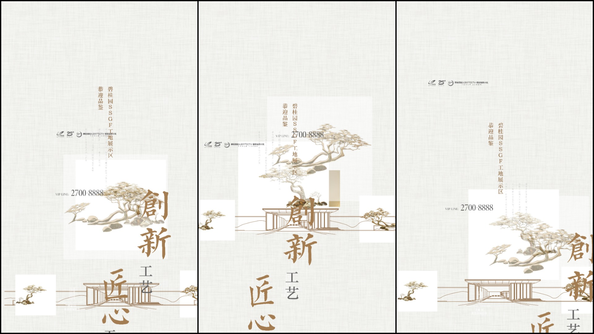

# Non Linear Regression Source Code

Input data is split into train and test variables using **train_test_split**. Data is run through the non-linear regression algorithms, **DecisionTreeRegressor, KNeighborsRegressor, and RandomForestRegressor** to generate prediction outputs.

```python
# Input values
output = pd.read_csv("output.csv").values
data = ['test10.csv','test20.csv','test30.csv','test40.csv','test50.csv','test60.csv','test70.csv','test80.csv','test90.csv','test100.csv','test110.csv','test120.csv','test130.csv','test140.csv']

datax = data[i]
df = pd.read_csv(datax)
target_column = ['xcentv','ycentv']

predictors = list(set(list(df.columns))-set(target_column))
df[predictors] = df[predictors]/df[predictors].max()


x = df[predictors].values
y = df[target_column].values

x_train, x_test, y_train, y_test = train_test_split(x,y,test_size=0.3,random_state=40)

# Regression algorithms
dtree = DecisionTreeRegressor(max_depth=50)
dtree.fit(x_train, y_train)

kneighbor = KNeighborsRegressor()
kneighbor.fit(x_train,y_train)

model_rf = RandomForestRegressor(n_estimators=300, oob_score=True, random_state=100)
model_rf.fit(x_train, y_train)


# Predictions
xin = output[z]
xin = np.array(xin)
pred_tested_dtree = dtree.predict(xin)
pred_tested_rf = model_rf.predict(xin)

# Error calculation
pred_train_rf = model_rf.predict(x_train)
ytrain.append(np.sqrt(mean_squared_error(y_train, pred_train_rf)))
```

# Image Display

**DecisionTree Regressor &emsp;&emsp;&emsp;&emsp;&thinsp;&thinsp; KNeighbors Regressor &emsp;&emsp;&emsp;&emsp;&emsp; RandomForestRegressor**

