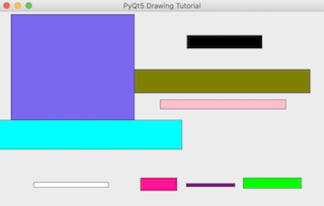
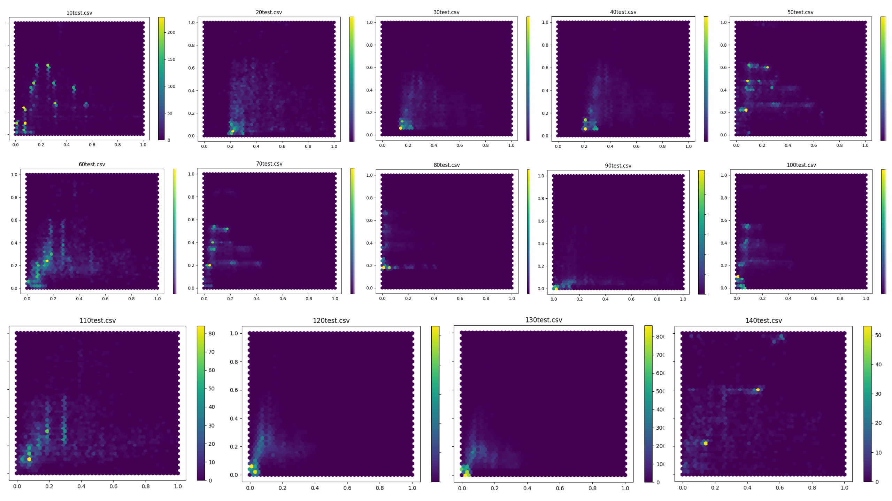

# Image display example using PyQt5
An example image created with image layer data points from data set.

### Example Dataset:
**Height:** 3543  
**Width:** 5906

|Layer|Order|X-Cords|Y-Cords|
|-----|-----|-------|-------|
|<span style="color:#00FFFF">Title</span>|30|3318|539|
|<span style="color:#7B68EE">Subtitle</span>|40|2236|2342|
|<span style="color:#800080">Developer Logo</span>|70|887|65|
|<span style="color:#FF1493">Address</span>|80|661|232|
|<span style="background-color:black"><span style="color:white">Sales Info</span></span>|90|1366|244|
|<span style="color:#00ff00">Disclaimer</span>|100|1055|196|
|<span style="color:#FFC0CB">Graphics</span>|120|2279|173|
|<span style="color:#808000">Graphics 2</span>|130|3188|433|
|<span style="color:black">Other</span>|140|1358|98|

<br/>


<div style="text-align:center"></div>

# Heatmap Development
- Image layer data is sorted into 14 different groups based on ID number  
- Normalized data is standardized through Min-max scaling to fit a range of 0.0-1.0

**Normalization Formulas:**
<p align="center">

<br/>

</p>

**Source Code to generate heatmap for layer ID 20:**

```python
import pandas as pd
import matplotlib.pyplot as plt
from sklearn import preprocessing

data = '20test2.csv'
df = pd.io.parsers.read_csv(
    data, header=None, usecols=[0,1])

df.columns=['xcenter','ycenter']

minmax_scale = preprocessing.MinMaxScaler().fit(df[['xcenter','ycenter']])
df_minmax = minmax_scale.transform(df[['xcenter','ycenter']])

def plot():

    plt.hexbin(df_minmax[:,0],df_minmax[:,1],gridsize=35)
    plt.title('Layer 20')
    plt.colorbar()
    plt.show()

plot()
```

**Heatmaps for all 14 Layers:**


